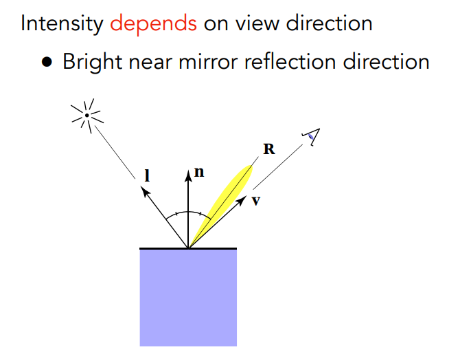
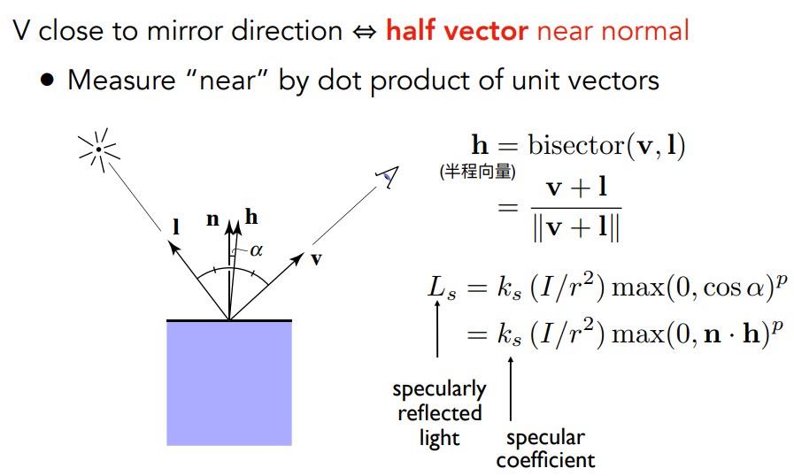
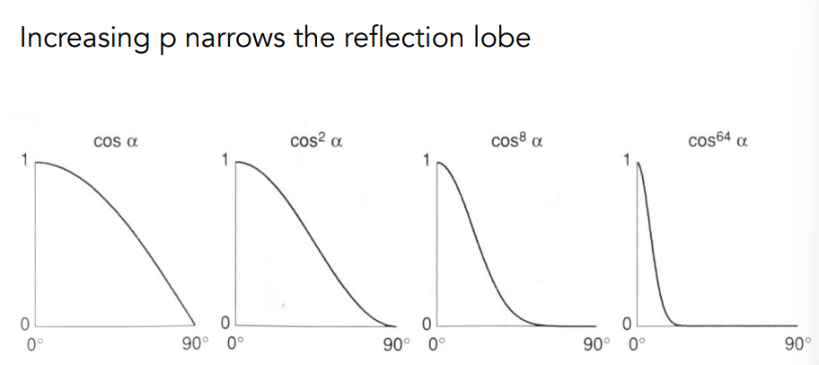
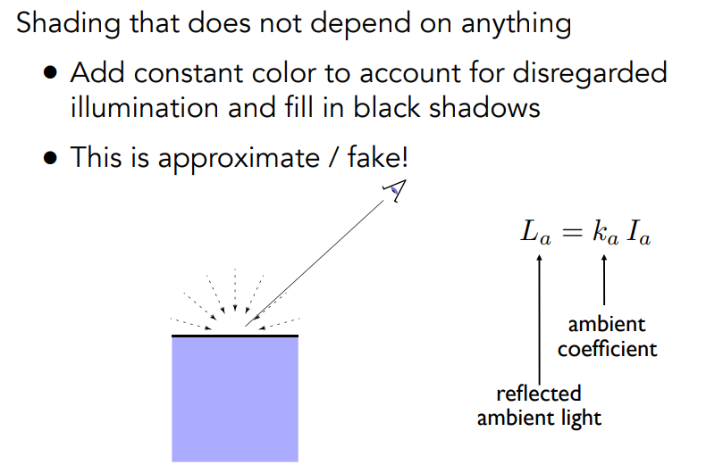
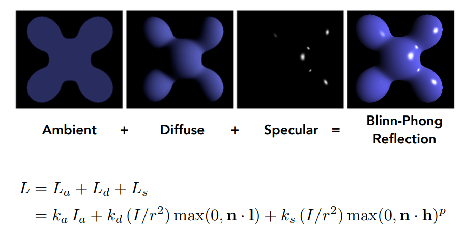
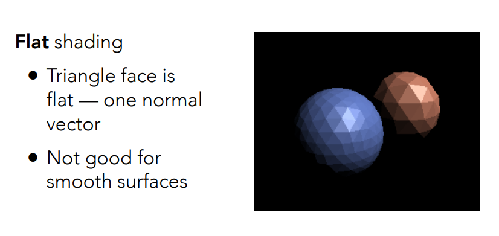
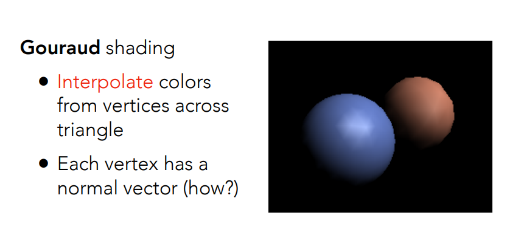
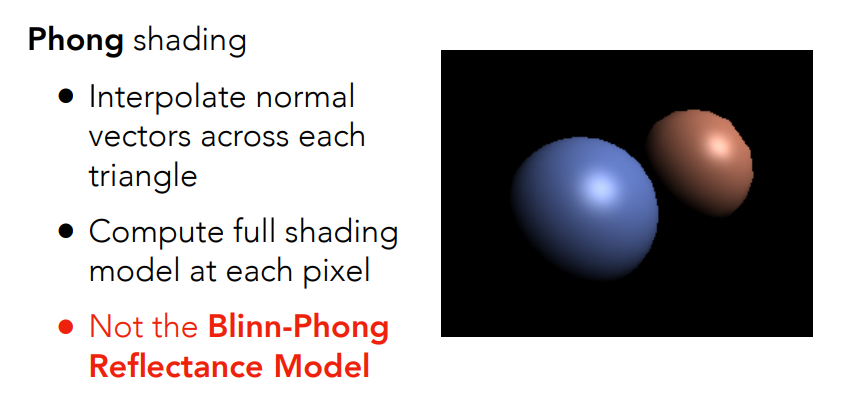
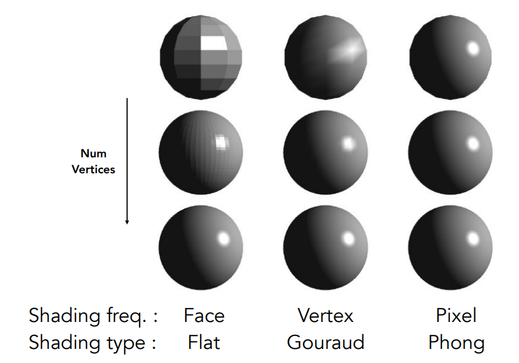
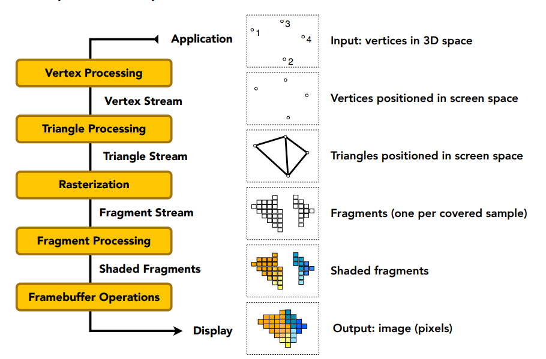

# Blinn-Phong reflectance model 

## Recap: Lambertian (Diffuse) Term 

##  Specular Term 

- 高光是白色的，所以Ks的属性是白色的
- 半程向量用平行四边形法则很容易算出来

1. 经验模型，简化模型，没有考虑有多少能量被吸收（漫反射的那个energy received），仅用来判断是否能看到高光。

2. 为什么不用**R**•**v**？**R**•**v**是 Phong Reflective Model ，因为反射方向不好算，所以改进为用**v**•**l**。

3. 指数p：高光只能很小一部分能看到，这里用指数p来加速光亮的衰减（也就是说，控制高光的大小），实际应用时的p一般为100~200。

   

## Ambient Term

- 假设：任何点接收的环境光相同。
- 环境光和 l、v、n 均无关，是一个常数
- 作用：Add constant color to account for disregarded illumination and fill in black shadows  保证模型没有一个地方全黑

## Blinn-Phong Reflection Model 

- 光 与 物体到观察点的距离 无关，后续课程会讲

# Shading Frequencies 

平面 -> 顶点（颜色插值） -> 像素（法线方向插值）

## Shade each triangle (flat shading)  

法线方向求法：三角形两边做叉积

## Shade each vertex (Gouraud(高洛德) shading) 

### Per-Vertex Normal Vectors 

顶点法线：求**相邻面法线的平均**（根据面积大小的加权平均 / 简单平均） -> 归一化

### Per-Pixel Normal Vectors 

逐像素法线：利用**重心坐标**对顶点法线进行插值

## Shade each pixel (Phong shading)  

## Shading Frequency: Face, Vertex or Pixel 

观察结论：

- 模型足够复杂时，Flat Shading 效果也挺好的
- 实际情况中，三角形面数也可能超过像素个数，用 Flat Shading 反而开销大
- 所以说该用哪种 Shading Frequency 取决于具体情况、具体物体

# Graphics (Real-time Rendering) Pipeline 

1. **Input**：空间中的点

2. **Vertex Processing**：MVP变换，把三维空间中的点投影到平面上

3. **Triangle Processing**：点连成三角形

4. **Resterization**：然后要把三角形画在离散的屏幕上，用到的方法：光栅化（采样、深度测试(细分也是**Fragment Processing**)），把三角形离散为Fragment

   Fragment ==(without MSAA)==  Pixel

   Fragment ==(MSAA)==  Sample

5. **Fragment Processing**：着色

   Gouraud Shading -> Vertex Processing

   Phong Shading -> Fragment Processing

- 这套渲染管线是在硬件GPU里写好了的
- 部分可编程 -> 决定顶点/像素如何被着色 -> 代码称为 shader

## Shader Programs

- 在硬件上执行的语言

- Program vertex and fragment processing stages

  - 顶点操作 - Vertex Shader 顶点着色器
  - 像素操作 - Fragment / Pixel Shader 片段/像素着色器

- Describe operation on a single vertex (or fragment) 

  是通用的代码，只需要规定一个顶点/像素如何被着色，不需要用到for循环

- 可以开始学着写图形API了

  推荐网站：http://shadertoy.com/view/ld3Gz2

## GPU

- 随着技术的发展，出现了Geometry Shader、非常厉害的Compute Shader（General purpose GPGPU）

- GPU分两种：独立显卡，集成显卡

- GPU是高度并行化处理器

  GPU并行度>>CPU，性能不强、并行度高，适合做图形学的东西（比如对很多个像素，着色方法着色代码基本相同）
