# Texture Mapping

- 需求：定义物体上任何一点的不同属性

- Surface lives in 3D world space

  Every 3D surface point also has a place where it goes in the 2D image (texture). 

  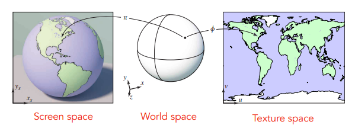

  纹理 -> 一张图

  纹理映射 -> 把纹理图蒙在三维物体的表面，形成一一对应的关系

- 怎样能把空间中的三角形映射到纹理上？-> 这点我们不关心，默认已知

  1. 艺术家创造（ 在美术建模的时候，就由建模软件制定好了关系，我们就当做我们能够知道模型表面上任意一点在纹理的哪个位置即可 ）
  2. 自动化（重大研究方向：参数化）

## Texture Coordinates

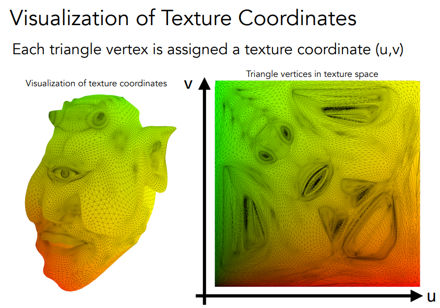

- 规定u、v∈[0, 1]，方便处理
- 三角形三个顶点，每一个顶点对应一个(u, v)，之后可以通过重心坐标计算出三角形内任意一点所对应的(u, v)

## 无缝贴图

- 可以像贴瓷砖一样贴纹理

  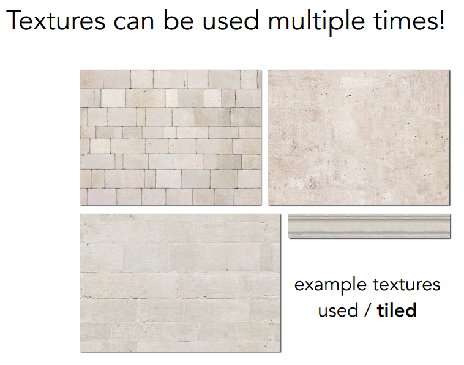

- 如何制作上下左右无缝衔接的贴图？

  算法：Wang Tiles（王氏砖）

## 着色和材质？

老师说 着色 = 材质，让我些许迷惑

查找到了unity官方文档解释如下：

> 在给定的着色器中有许多属性，可由**使用该着色器的材质**为它们赋值。这些属性可以是数字、颜色定义或纹理，在查看材质时会显示在检视面板中。然后，附加到游戏对象的渲染器组件将使用材质来渲染每个游戏对象的网格。 
>
> 
>
> 更具体地说，着色器定义了：
>
> - 对象渲染方法。此方法包括代码和数学计算，其中可能包括光源的角度、视角以及任何其他相关计算。着色器还可根据最终用户的图形硬件指定不同的方法。
> - 可在材质检视面板中自定义的参数，例如纹理贴图、颜色和数值。
>
> 材质定义了：
>
> - 用于渲染此材质的着色器。
> - 着色器参数（例如要使用的纹理贴图、颜色和数值）的具体值。

确实是差不多的概念，严格来说，材质使用了着色器，确定着色器的参数。

# Interpolation Across Triangles: Barycentric Coordinates 

> 三角形的三个顶点，有各自不同的属性，如何把这个属性在三角形内部做一个平滑的过渡？

## Interpolation Across Triangles 

Why do we want to interpolate? 

- Specify values at vertices 
- Obtain smoothly varying values across triangles 

What do we want to interpolate? 

- Texture coordinates, colors, normal vectors, … 

How do we interpolate? 

- Barycentric coordinates 

## Barycentric coordinates 

### 定义

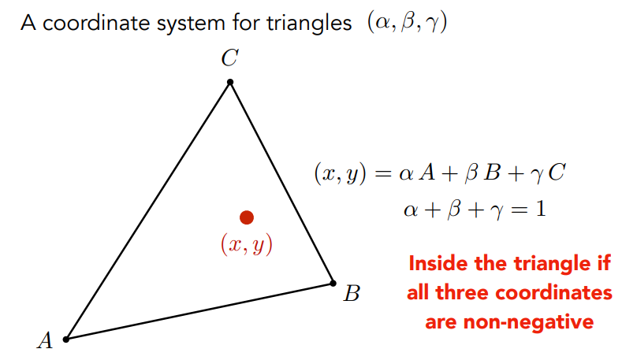

- α + β + λ = 1 ：点在三角形所在的平面内

  > 共面向量定理 推论1：
  >
  > 设O、A、B、C是不共面的四点，则对空间任意一点P，都存在唯一的有序实数组 (x,y,z) 使得**OP**=x**OA**+y**OB**+z**OC** 说明：若x+y+z=1 则PABC四点共面

- α, β, λ > 0 ：点在三角形内部

### 如何计算重心坐标

- 已知点A、B、C、P的坐标，求 (α, β, λ) ，可列方程求解：

  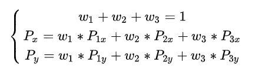

  > 具体推导过程：
  >
  > https://zhuanlan.zhihu.com/p/58199366

  可以得到：

  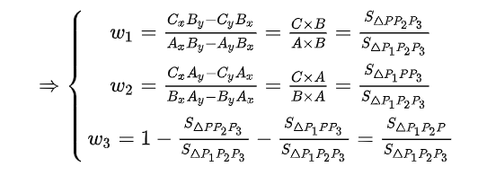

- 所以有公式：顶点所对小三角形的面积占比

  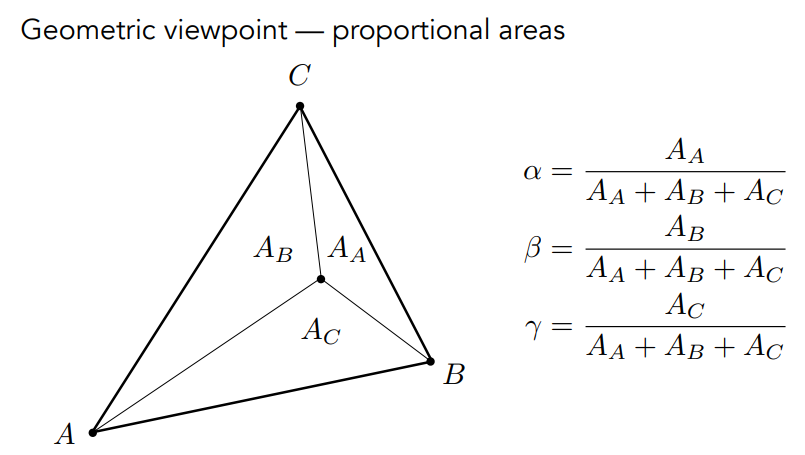

- 简化为叉乘公式的坐标结果，方便计算：

  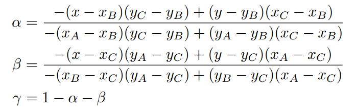

## Appliance

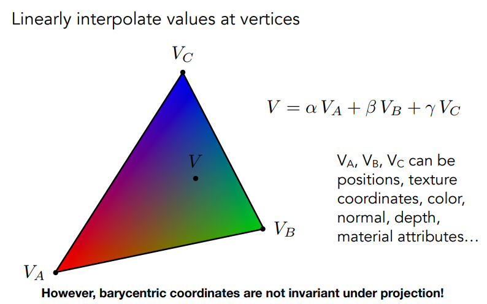



- 重心坐标在**投影后会发生改变**， 比如3D时重心坐标可能是(0.5,0.2,0.3), 到了2D后就变成了(0.4,0.4,0.2) ，这样会导致插值结果产生比较大的偏差

- 所以如果要对**三维空间中的属性**进行插值，就要取**三维空间中的顶点坐标**，计算出**重心坐标**后，对该属性进行**插值**计算。

  不能用投影之后的顶点坐标计算出重心坐标，然后做插值

  eg. 深度插值时，需要计算出三维空间的重心坐标在三维空间中做插值，然后把插值结果对应到二维空间中去



# Applying Textures

- 三角形顶点(u, v)   --插值-->  每个采样点的 (u, v)

## Simple Texture Mapping: Diffuse Color 

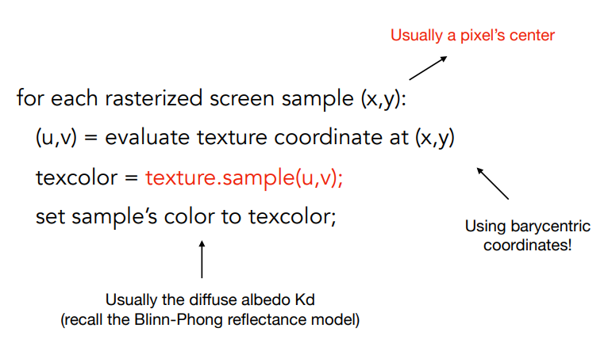

## Problems

###  Texture Magnification(easy case)

- Generally don’t want this — insufficient texture resolution
- A pixel on a texture — a **texel** (纹理元素、纹素) 

In this case, many pixels  --映射-->  1 texel

一个纹素要对应多个像素，在实际渲染时产生的效果就是纹理被拉伸，视觉上会有模糊的感觉

####  Bilinear Interpolation 

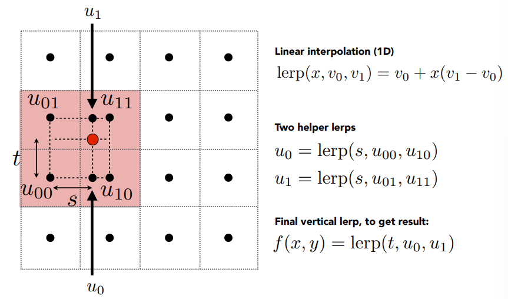

 Bilinear interpolation usually gives pretty good results at reasonable costs 

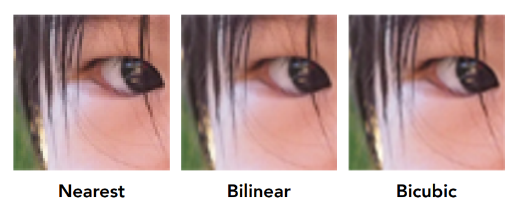

Bicubic：利用周围的16个点进行三次方的插值，可以得到更好的效果

### Texture Minification(hard case)

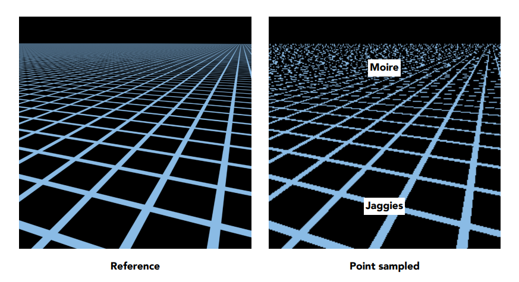

- 因为透视投影的近大远小效果，在近处 多个屏幕像素对应到一个纹理像素，在远处 **一个屏幕像素会对应到多个纹理像素，这就产生了摩尔纹**。

- 屏幕上的像素覆盖纹理上的区域大小各不相同：

  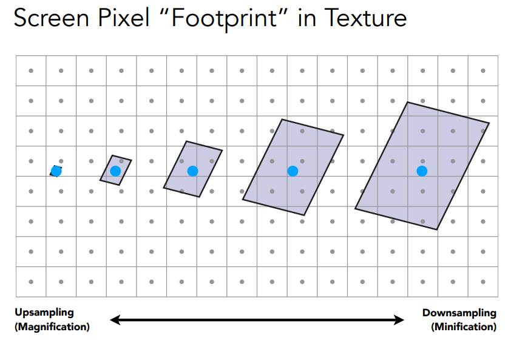

  - 用中心点的(u, v)坐标对应的值作为这一片区域的平均值，显然不对

  - 一个像素内部纹理的变化频率很高（高频信号），用一个采样点采样肯定不行（低频采样）

#### Supersampling？ 

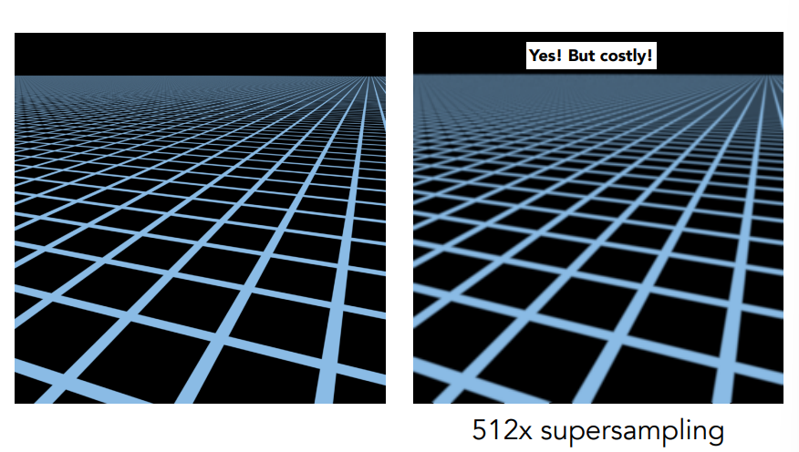

Will supersampling work? 

- Yes, high quality, but costly 
- When highly minified, many texels in pixel footprint
- Signal frequency too large in a pixel
- Need even higher sampling frequency 

Let’s understand this problem in another way

- What if we don’t sample?

- Just need to get the average value within a range!  

  点查询 vs. 范围查询（且能查询任意不同大小的范围）

#### Mipmap

Allowing (**fast, approx., square**) range queries 

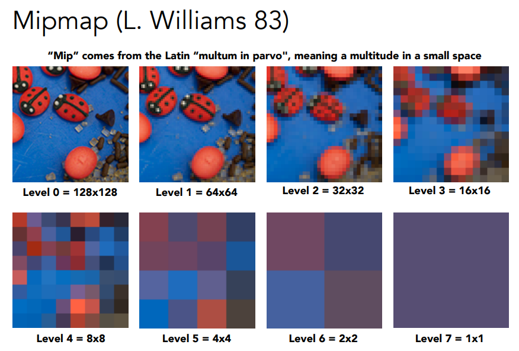

- 总共有 log2(128) 层

- 占用存储空间：

  每一层的存储量是上一层的1/4，等比数列求和，可得存储量

  1 -> 1+1/3 = 4/3

- 假如一个屏幕像素覆盖了4个左右的纹理像素，即L=2，那么我们自然要使用第一层的mipmap，而要是覆盖了16个左右像素，L=4，就应该用第二层的。也就是说如果一个屏幕像素覆盖了L*L个纹理像素，那么就应该使用 D = log2L 层mipmap。

  一个像素覆盖的区域在D层会对应到1个像素

- 那么我们就要知道我们的一个屏幕像素到底覆盖了多少的纹理像素，也就是求L的值。

  近似地求出L的值如下（不太懂这个公式怎么求的）：

  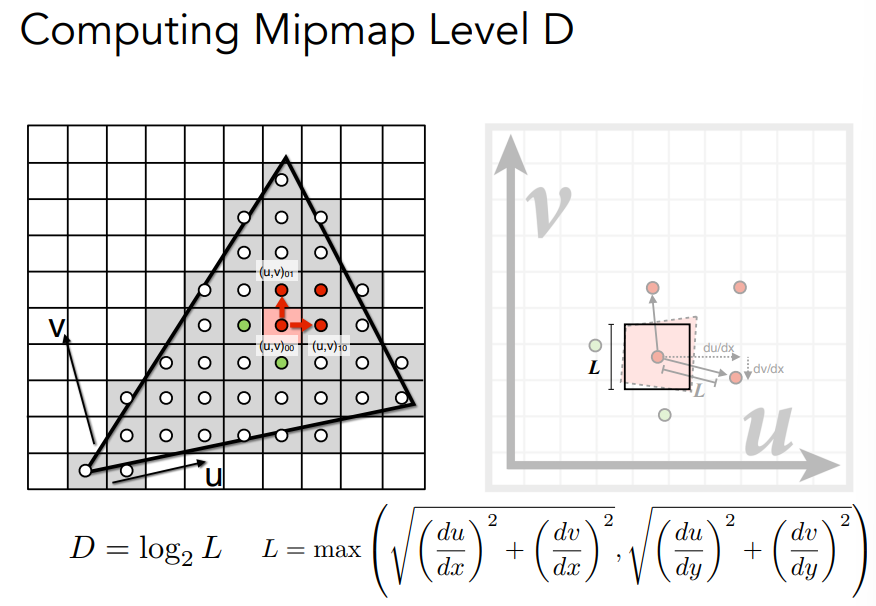

##### Trilinear Interpolation 

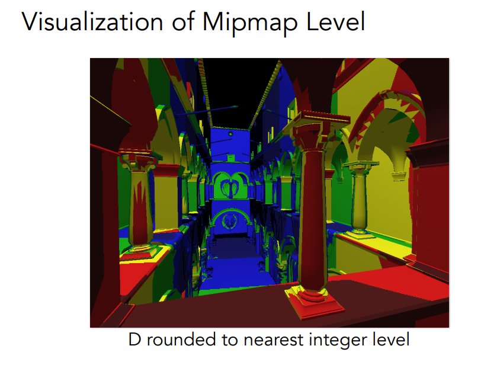

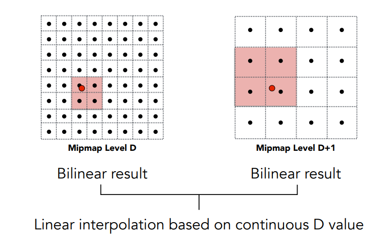

- 先用双线性插值求出D层和D+1层的值，然后再用线性插值求出D+x层的值（x范围：0~1） 

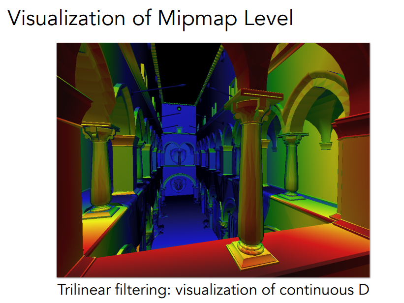

- 开销：2次查询，1次插值，开销比较小

##### Limitations

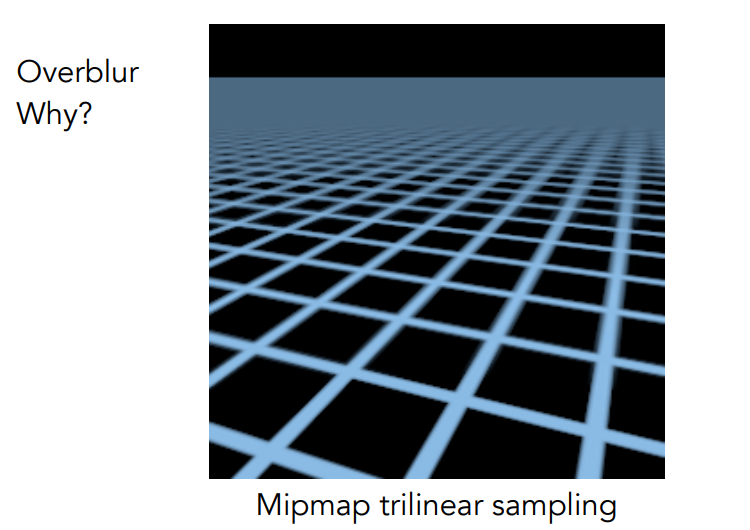

- 原因：mipmap是不够准确的，且默认是正方形覆盖范围的

  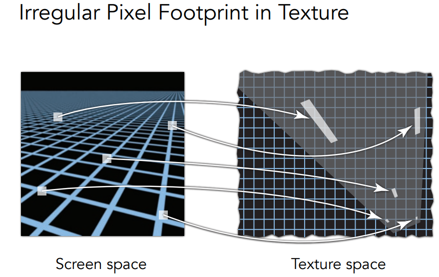

- 能解决部分问题的办法：**Anisotropic Filtering **，各向异性过滤

  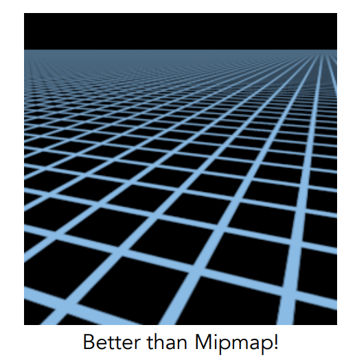

  1. 允许对长条形的区域做一个快速的范围查询

     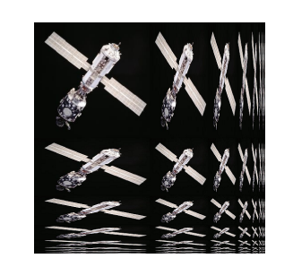

  2. 占用空间：1 -> 1+3=4

  3. 对于斜向的覆盖范围，效果也不是很好

  4. 各向异性生成的一系列纹理图也叫**Ripmaps**

  5. 游戏中的各向异性过滤，只要显存足够就可以打开，和计算力无关，x 意味着开到多少层

- **EWA filtering** 

  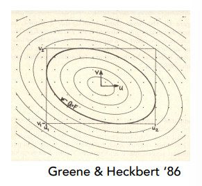

  任意不规则形状的覆盖范围可以拆分成很多不同的圆形覆盖

  代价是要进行多次查询

  （具体也不太懂）

# Applications of Texture

## Many Uses

In modern GPUS, texture = memory + range query (filering)

可以把纹理理解成一块数据，可以对这块数据进行不同种类的查询（点查询/范围查询），而不用局限于图像上。

从这个角度上出发，纹理可以表示好多好多东西

## Environment Map 环境光照

环境贴图/环境光照：记录下来任何方向的光（不区分直接光还是反射光，人眼环绕屋子一周看到的光记录下来）

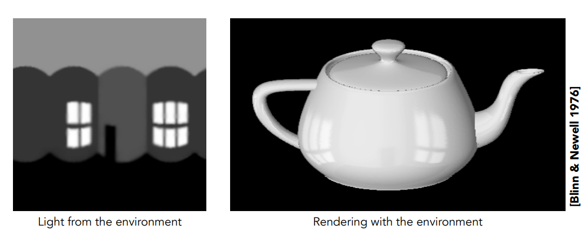

- 可以用纹理描述整个环境光长什么样，然后可以用这个环境光去渲染其他的物体，比点光源要好很多。

- 图形学上的经典的、广泛应用的模型之一：犹他茶壶

- 假设：认为光源来自无限远，没有实际的深度意义。环境贴图只记录光源的方向信息（不记录光源的位置信息）（ 否则即使同一个墙的同一个点，在不同位置看上去，光的方向就会发生变化）

### Spherical Environment Map

把环境光记录在球面上，然后展开

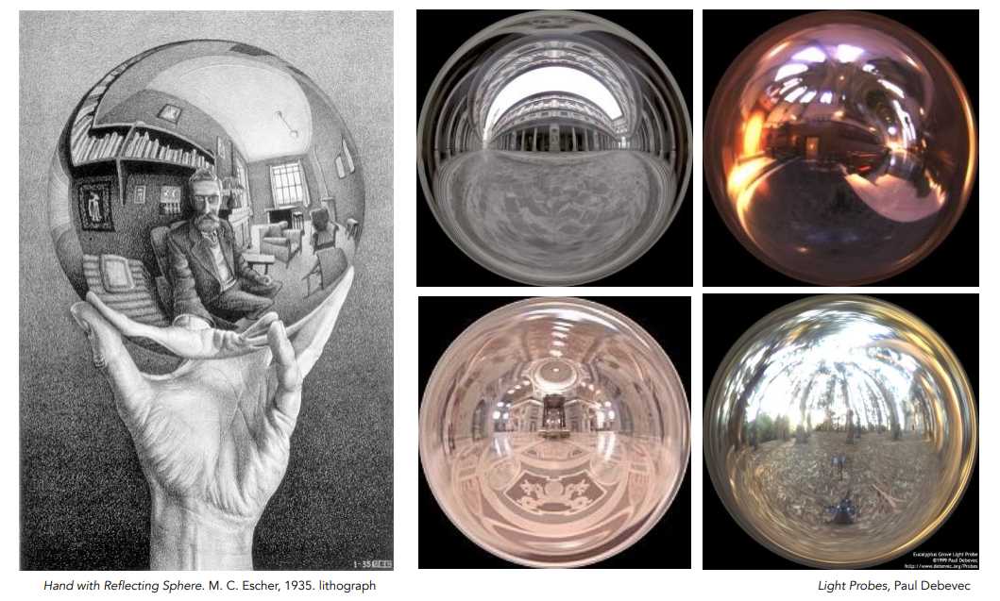

#### Problem

头部和底部向中间扭曲

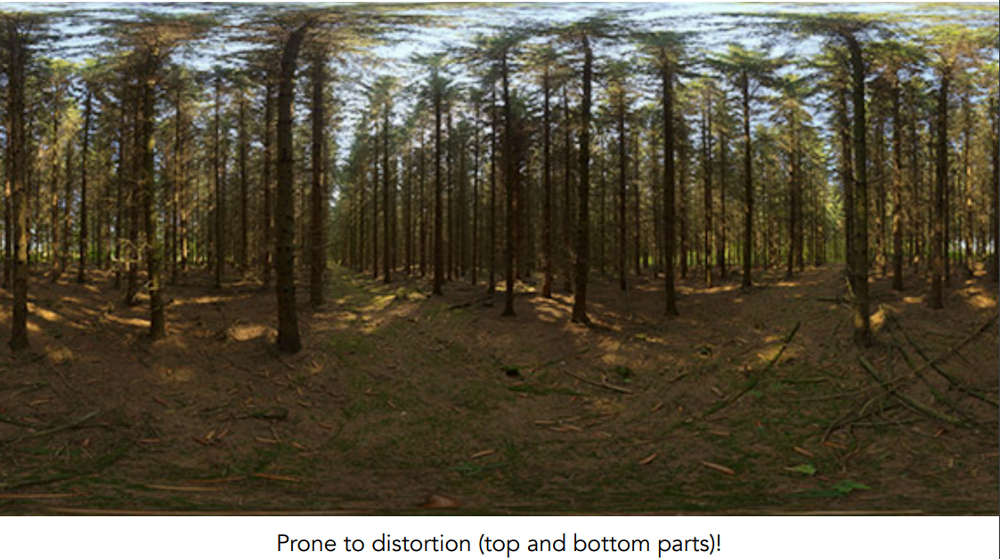

不能均匀描述球上不同位置，靠近极点的地方（比较窄）会出现扭曲现象。

#### Solution: Cube Map

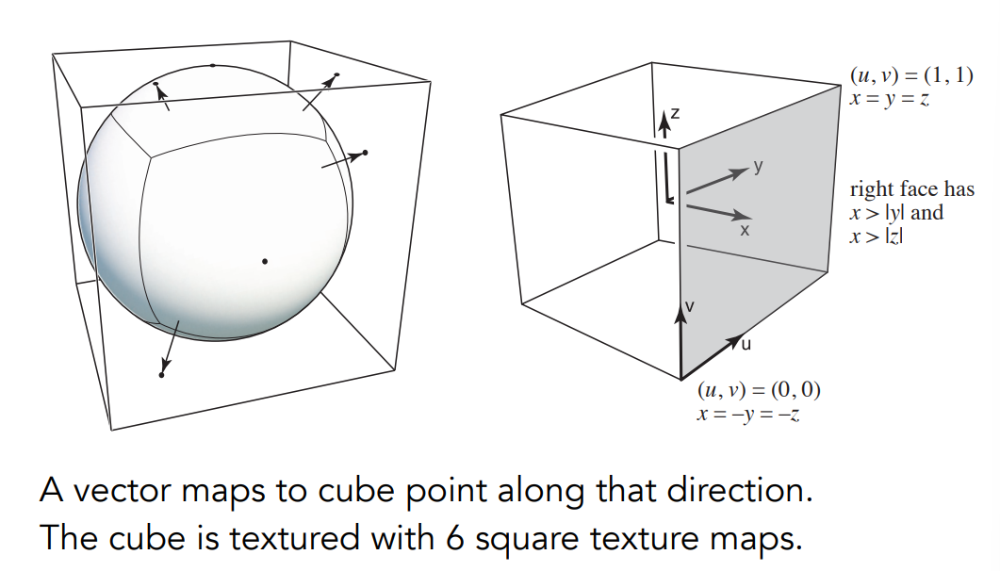

- 球外边增加一个包围盒，将光照信息存在立方体的表面上

- 立方体个个面均匀，很少有扭曲的现象发生

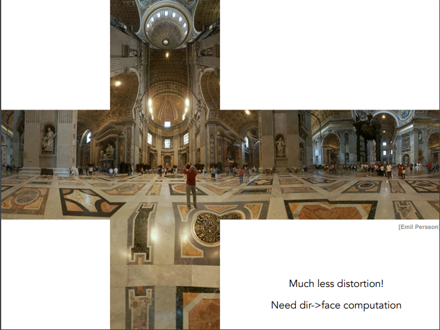

- 想看来自于某一个方向的光照是多少，球上可以很容易的求出来，现在需要先判断这个方向被记在了立方体的哪一个面上，需要额外的计算（但是非常快）
- 这两种描述环境光的方式，本质都是一样的——都是为了描述来自不同方向的光照信息（不管是直射的光，还是反射的光）

## Bump / normal mapping 凹凸贴图/法线贴图

### 是什么

- 纹理可以定义任何不同位置的任何不同属性，所以，纹理也可以定义表面上任意一个点的相对高度（相对基础表面沿着法线方向往上往下各走多少）是多少

- Adding surface detail without adding more triangles

  在不把几何形体变复杂的情况下，可以通过应用复杂的纹理，从而定义任何一点的相对高度
  
  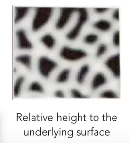
  
  相对高度变化 -> 法线发生变化 -> shading的结果发生变化（着色产生明暗对比）
  
  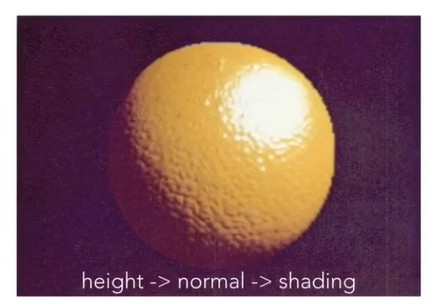通过纹理映射，人为的做一个假的法线，用假的着色结果欺骗人的眼睛，让人觉得有凹凸的效果

### 具体操作

- Perturb surface normal per pixel

  (for shading computations only)

  法线扰动

- How to modify normal vector?

  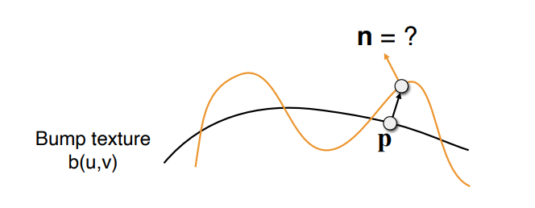

#### How to perturb the normal (in flatland)

- Original surface normal n(p) = (0, 1)

- Derivative at p is dp = c * [h(p+1) - h(p)]

  导数的定义：水平方向移动一个距离，竖直方向移动多少

  切点处的导数等于切线斜率，得到切线

  c 用来定义凹凸贴图的影响大不大

- Perturbed normal is then n(p) = (-dp, 1).normalized() 

  切线向量 (1, dp) 

  把切线逆时针旋转90度，得到法线向量 (-dp, 1)

  normalized 归一化

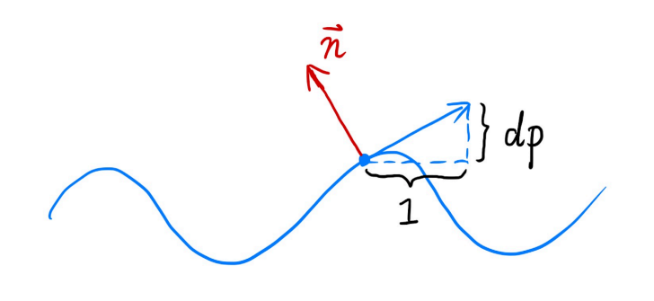

#### How to perturb the normal (in 3D)

- Original surface normal n(p) = (0, 0, 1) 

- Derivatives at p are

  - dp/du = c1 * [h(u+1) - h(u)] 
  - dp/dv = c2 * [h(v+1) - h(v)]

- Perturbed normal is n = (-dp/du, -dp/dv, 1).normalized()

- Note that this is in local coordinate! 

  假设原来的法线方向是 (0, 0, 1) ，所以要用局部坐标系来计算扰动后的法线方向，然后再重新计算回世界坐标里

  More will be elaborated in FAQ of HW3 

### Displacement mapping 位移贴图

- 凹凸贴图的缺点：
  1. 边缘处会露馅（还是原来的模型形状）
  2. 复杂的模型，自己突起的部分会有阴影投影到自己身上，这点凹凸贴图也无法体现

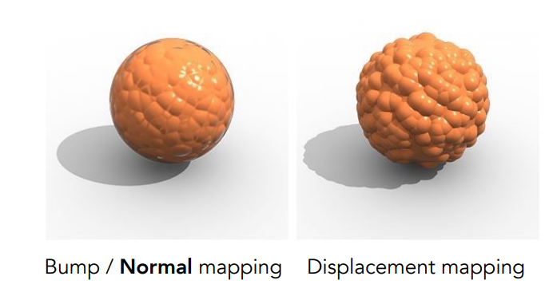

- a more advanced approach 
  - Uses the same texture as in bumping mapping 
  - Actually moves the vertices 
  - 要求模型原本的三角形足够细，跟得上定义的纹理的变化速度
    - DirectX 可以根据需要对三角形进行细分

## Other applications

### 3D Procedural Noise + Solid modeling

- 实际上是定义了空间中任何一点的值

- 定义了三维空间中的噪声函数，经过一系列操作后，变成需要的样子

- 广泛应用的 Perlin noise，用于生成山脉等

  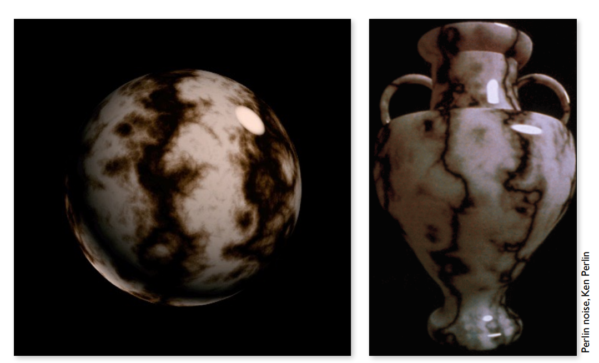

### Provide Precomputed Shading 

纹理可以用来记录之前已经计算好的信息

- 眉骨对眼框的投影的计算和渲染：环境光遮蔽

  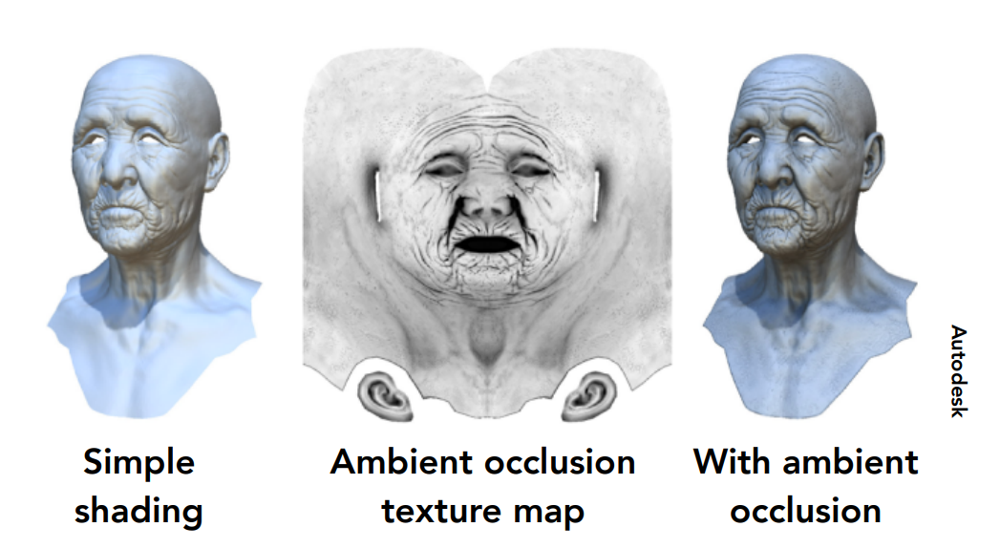

#### 3D Textures and Volume Rendering 

三维纹理记录三维的各种信息，用于体积渲染

比如医学上的核磁共振得到三维的密度信息等

