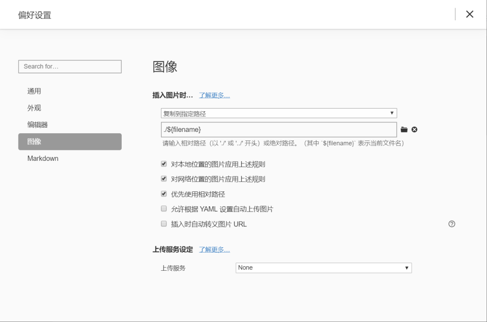
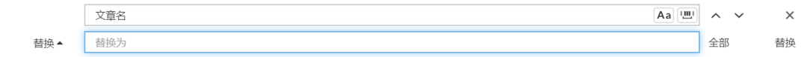


总结一下hexo博客的进阶用法和常见问题。（真是折磨的过程qwq）


# 备份

## 原理

这里可以简单的理解，我们的博客是托管到 GitHub 上的。而我们每次上传（hexo d）的是网页文件，不是我们的文章。

所以我们如果想上传文章，但同时不会干扰到网页部署，就在 GitHub 的博客仓库上建立一个分支 hexo，这个 hexo 分支的作用就是用来保存我的 MarkDown 文章和一些其他文件。

> 参：https://blog.csdn.net/qq_37391214/article/details/100186909

## 操作

获取博客仓库.git文件夹

1. 我们先建立一个文件夹，名字随便，我这里叫 hexo，在该文件夹空白处，启动 Git Bash

2. 先克隆我们博客的仓库

   ```shell
   git clone https://github.com/xxx/xxx.github.io.git
   ```

   过后，它会把我们仓库复制下拉，这里仅仅只是为了获得版本管理的 **.git** 隐藏文件夹。 

   > windows系统如何查看隐藏文件夹：https://blog.csdn.net/sinat_16643223/article/details/109117067?spm=1001.2101.3001.6650.2&utm_medium=distribute.pc_relevant.none-task-blog-2%7Edefault%7ECTRLIST%7ERate-2.pc_relevant_default&depth_1-utm_source=distribute.pc_relevant.none-task-blog-2%7Edefault%7ECTRLIST%7ERate-2.pc_relevant_default&utm_relevant_index=5

3. 建立一个分支，我这里分支名为 hexo ，输入代码：

   ```shell
   git checkout -b hexo
   ```

4. 克隆下来的都是一些编译后的静态网页。我们也不需要，只要 .git 文件夹就行。 

   删除除了 .git 文件夹之外的所有文件，然后将当前保存到待添加列表：

   ```shell
   git add --all
   ```

5. 提交到本地仓库

   ```shell
   git commit -m  "清空hexo分支仓库"
   ```

6. 推送到远端更新

   ```shell
   git push --set-upstream origin hexo 
   ```

   这个命令同时设置了以后默认分支为hexo分支，回到自己博客的根目录下打开git bash，路径后面括号里的就是默认分支。如果设置不成功，可以登录github，找到博客项目，点击Settings-Branches切换默认分支。

7. 确保博客 站点配置文件 _config.yml 的默认提交分支要确保为 master 

   ```yaml
   deploy:
     type: git
     repo: https://github.com/Witman1999/Witman1999.github.io.git
     branch: master #提交的默认分支
   ```

8. 把 .git 文件夹移动到博客的根目录下

9. 如果你的主题文件，是克隆 Github 下来的，那么会带有该主题的 Github 的 .git 版本管理文件，也就是 .git 文件夹。所以主题下面的要删除 .git 文件夹（和 .gitignore 文件，我的没有），否则会忽略这个主题的上传。 

### 将相关更改（配置修改或发表文章）推送到hexo分支

1. `git add --all` 
2. `git commit -m` “提交源文件”
3. `git push` （这里要确保提交的分支为 hexo ，在前面的步骤可以查看，如果不是可以输入 `git checkout hexo`切换分支）

```shell
git add .
git commit -m "修改配置/发表文章"
git push origin hexo
```

### 将静态文件推送到master分支

```shell
hexo clean 
hexo g
hexo d
```

## 迁移

1. 环境安装

   ```shell
   npm install -g hexo-cli
   hexo init
   npm install
   ```

2. 克隆hexo分支

   ```shell
   git clone -b hexo https://github.com/username/username.github.io
   ```


# 图片显示

找到了一种方法可以使得本地和网页都可以看到博客图片。

> 参：https://blog.csdn.net/qq_41907806/article/details/109064385https://blog.csdn.net/qq_41907806/article/details/109064385

1. 安装图片插件

   用`npm install hexo-renderer-marked`命令安装插件 hexo-renderer-marked ，之后在config.yaml中更改配置如下：

   ```yaml
   post_asset_folder: true #当该配置被应用后，使用hexo new命令创建新文章时，会生成相同名字的文件夹，也就是文章资源文件夹。这个设置和该插件无关。
   marked:
     prependRoot: true
     postAsset: true
   # 使用的方式插入图片
   ```

2. `hexo new 'title'` 

   > 引号可以不加，标题有空格一定要加

3. Typora设置

   文件->偏好设置：

     

   使用该配置后，可以直接复制网页中的图片地址，粘贴到Typora中后，会直接复制该图片到文章资源文件夹，同时自动更改路径。

   如复制网络路径的图片https://...../image.jpg粘贴到Typora中叫文章名的文章后，图片会自动变为``。

   但我们知道部署后，文件路径是不同的，所以当我们插入完所有的图片后，我们还需要删除每个图片路径中的文件名/。不慌，也很简单。

   在Typora编辑器中，使用 ctrl + f 快捷键，将所有的文章名/替换为空即可删除。
     

   > 经测试，**不需要替换为空**！直接可以用，贼拉方便ovo

# 常见问题

## 如果你很久没有用过hexo d， 输入github用户名和密码后仍无法运行

是因为2021年8月13日后 需要用tokens当作密码登录

需要在github网站生成：

头像——settings——developer settings——Personal access tokens——generate new token

登陆 ——expiration（有效期，自己选）——把repo和deleterepo勾选上——生成——记得复制保存

再次使用hexo d 输入github 的user.name和密码（此处粘上tokens码）

成功运行，在github上生成框架部署。

ps.由于是新变化，跟之前的全局配置

git config --global user.name "用户名"

git config --global user.email "邮箱"

> 原文链接：https://blog.csdn.net/nolike666/article/details/120580936

## Openssl缺失

跟着这个链接下载配置：https://www.jianshu.com/p/b277101bbdb1

## Spawn failed

大多因为git进行push或者hexo d的时候改变了一些.deploy_git文件下的内容，多余本地提交之类的导致了报错 

```shell
进入站点根目录
cd E:/hexo
 
删除git提交内容文件夹
rm -rf .deploy_git/
 
执行
git config --global core.autocrlf false
 
最后
hexo clean && hexo g && hexo d
```

> https://blog.csdn.net/liegu0317/article/details/121886380

## SSL_read: errno 10054

```shell
git config --global http.sslVerify "false" #解除ssl验证
```

> https://blog.csdn.net/weixin_43479772/article/details/120402037

```shell
git config --global http.postBuffer 524288000 #加大缓存大小
```

> https://blog.csdn.net/weixin_43106956/article/details/119463752?spm=1001.2101.3001.6661.1&utm_medium=distribute.pc_relevant_t0.none-task-blog-2%7Edefault%7ECTRLIST%7ERate-1.pc_relevant_paycolumn_v3&depth_1-utm_source=distribute.pc_relevant_t0.none-task-blog-2%7Edefault%7ECTRLIST%7ERate-1.pc_relevant_paycolumn_v3&utm_relevant_index=1

## 443: Timed out

一般是网络问题

如果和代理有关，

查询代理

`git config --global http.proxy`

取消代理：查询到当前设置了代理，取消这个设置：

`git config --global --unset http.proxy`

> https://shliang.blog.csdn.net/article/details/100095212?spm=1001.2101.3001.6650.2&utm_medium=distribute.pc_relevant.none-task-blog-2%7Edefault%7ECTRLIST%7ERate-2.pc_relevant_default&depth_1-utm_source=distribute.pc_relevant.none-task-blog-2%7Edefault%7ECTRLIST%7ERate-2.pc_relevant_default&utm_relevant_index=5

## 写代码，尖括号和头文件消失

html语言解析出错，要用转义字符写尖括号，而且写完之后要空一格（我也不知道为什么）

> https://www.cnblogs.com/xudong-bupt/p/3909416.html